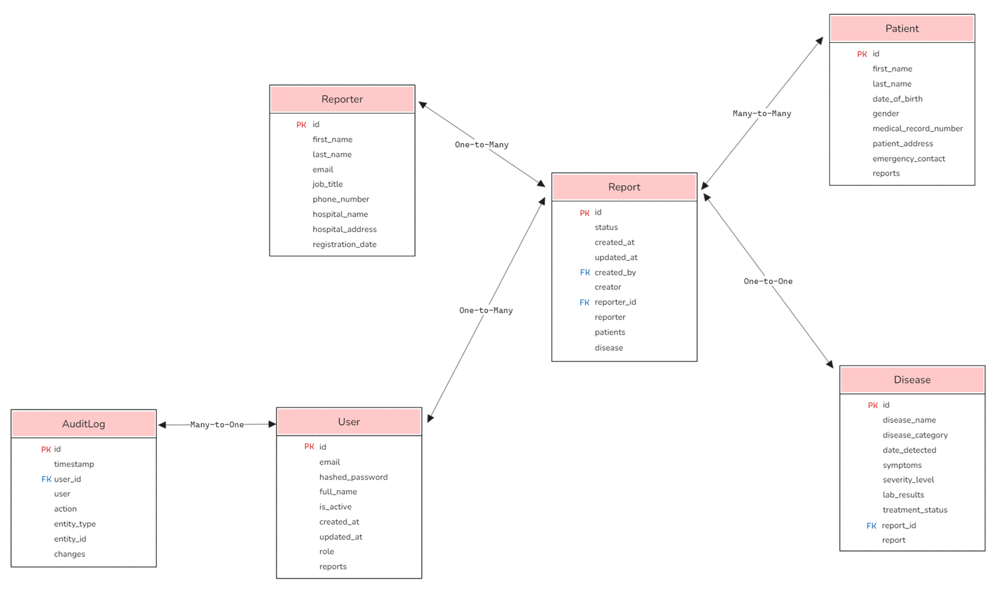

# Models, Schemas, and Relationships

## Broad overview - following a new disease outbreak

- When a single disease is detected in the population, a single report for that disease outbreak is created. The report is created by a reporter, and that reporter has ownership of the report they just created.

- The disease to report is a one-to-one relationship.
- Disease names must be written to be unique so as to enable annual recurrence of the same disease to be allowed without voiding the one-to-one relationship with reports:
  - For example "Covid-19", "Covid-19-ABC", "Covid-XYZ" etc.
  - This helps maintain the disease to report relationship as one-to-one.

- A single reporter has ownership over a specific report - but that same reporter can write many reports. Thus a one-to-many relationship from reporter to report.

- Regarding patients, it would be tedious if a new report was needed for an entire population of patients all suffering the same disease. Instead, a report should be able to have many patients attached to it.

## Summary of ownership and deletion flow

- A single report can have many patients, a single disease, and a single reporter.
- A single reporter can have many reports; deleting a reporter wipes their reports.
- A single patient can belong to many reports (each of which will be a disease - because patients can suffer from many diseases). Deleting a report does not touch the associated patient records.
- A single disease belongs to a single report. Deleting a report does not touch the associated disease records.
- Audit logs are permanent records, unaffected by user deletions.

| Entity Deleted | Cascade Effect                                                                           |
| -------------- | ---------------------------------------------------------------------------------------- |
| `Reporter`     | Can delete `Reports`. Does not delete `Patients`. `Diseases` handled via reports.     |
| `Report`       | Deletes `Disease`, Deletes association links with `Patients`, Does not delete `Patients` |
| `Disease`      | Cannot be deleted directly (must remove via `Report`)                                    |
| `Patient`      | Can be deleted independently, Does not affect `Reports`                                  |
| `User`         | Deletes `Reports`, Leaves `AuditLog` intact                                              |
| `AuditLog`     | Only explicit deletions; no cascade                                                      |

## SQLAlchemy Model Relationship Summary (Deletion Behaviour Focus)

### Reporter ↔ Report

- **Relationship**: One-to-Many.
- **Direction**:
  - One `Reporter` → Many `Reports`.
  - `Report.reporter_id` is optional so that we can create blank draft reports.

- **Deletion Behaviour**:
  - **Deleting a `Reporter`** cascades to **delete all their `Reports`** via `ondelete="CASCADE"`.
  - **Deleting a `Report`** does **not affect the `Reporter`**.
  - **ORM-level**: Removing a report from `reporter.reports` triggers `delete-orphan` (deletes the report).

### Report ↔ Patient

- **Relationship**: Many-to-Many (via `patient_reports` association table).
- **Direction**:
  - One `Report` → Many `Patients` (since many patients can have the same disease).
  - One `Patient` → Many `Reports` (since a single patient can have multiple diseases).
- **Deletion Behaviour**:
  - **Deleting a `Report`** removes the link in `patient_reports` but **does not delete `Patient` records**.
  - **Deleting a `Patient`** removes links in `patient_reports`, **other associated reports remain unaffected**.
  - **Cascade on association table only**, not on the patient entity itself (no accidental data loss).

### Report ↔ Disease

- **Relationship**: One-to-One.
- **Direction**:
  - One `Report` → One `Disease` (a report is made in response to a disease outbreak).
- **Deletion Behaviour**:
  - **Deleting a `Report`** cascades to **delete the associated `Disease`** via `ondelete="CASCADE"` and `delete-orphan`.
  - **Deleting a `Disease`** directly is **disallowed** due to `report_id` being non-nullable.
  - `single_parent=True` ensures a `Disease` can only belong to one `Report`.

### Report ↔ Creator (User)

- **Relationship**: Many-to-One
- **Direction**:
  - Many `Reports` → One `User` (creator)
- **Deletion Behaviour**:
  - **Deleting a `User`** cascades to **delete all their `Reports`** via `ondelete="CASCADE"`.
  - **Deleting a `Report`** does not affect the `User`.

### AuditLog ↔ User

- **Relationship**: Many-to-One (optional link)
- **Direction**:
  - Many `AuditLog` entries → One `User`
- **Deletion Behaviour**:
  - **Deleting a `User`** sets `user_id` to NULL or may leave audit entries as-is (depending on your DB schema defaults).
  - Audit logs are **never cascade-deleted**, preserving historical records.

### Entity-Relationship Diagram

